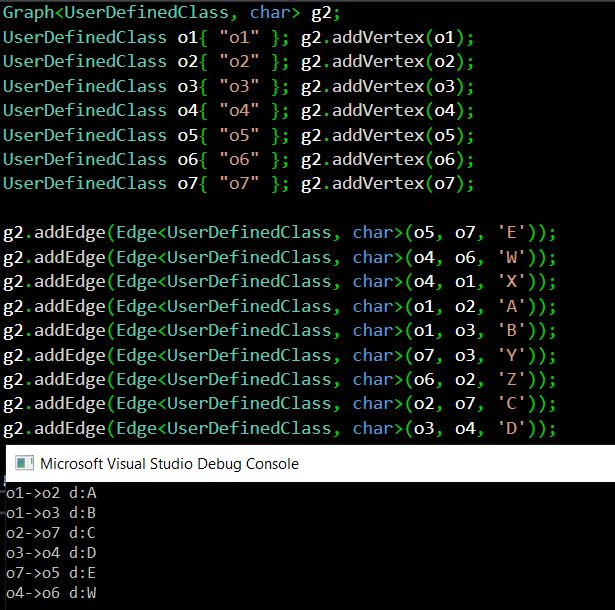
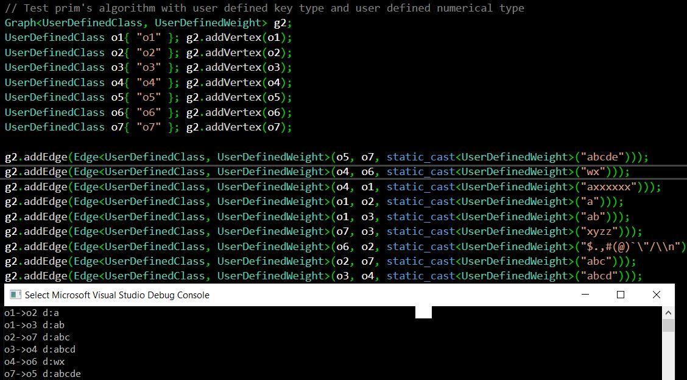
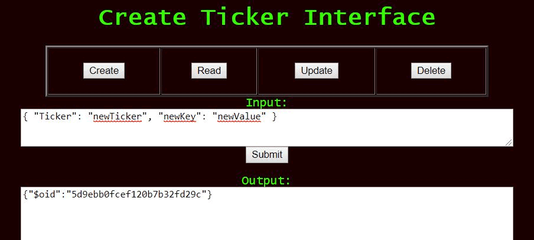

A professional assessment along with narratives for each piece of work here is found in the FinalProject.doc file hosted in this repo on Github.

# Software Engineering and Design:
### OmniChess
The video below illustrates the recently added random chess piece game mode:
<video controls width="660">

    <source src="/demo2.mp4"
            type="video/mp4">

    Sorry, your browser doesn't support embedded videos.
</video>

Relevant files from this project and a narrative are hosted at the following repo:
https://github.com/arasouli91/omniChess

# Algorithms and Data Structures:
### Graph Class and Prim's Algorithm
Below are images of test runs:

The project and narrative are hosted at the following repo:
https://github.com/arasouli91/graph

# Databases:
### Javascript/HTML Interface to MongoDB/Python REST Service
The animation below illustrates the interface's functionality:

The project and narrative are hosted at the following repo:
https://github.com/arasouli91/mongoInterface/

